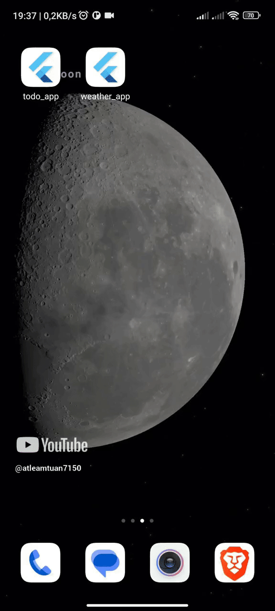

## Mô tả

Ứng dụng Weather Forecast giúp dự báo thời tiết dựa trên vị trí hiện tại của người dùng. Ứng dụng cho biết thời tiết hiện tại, dự báo thời tiết trong 24 giờ và 5 ngày sắp tới.

Ứng dụng được viết bằng Flutter, sử dụng Bloc để quản lý state, dữ liệu được lấy từ API của Weatherapi.com

## Demo

